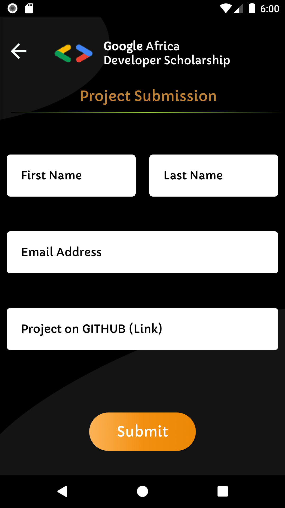
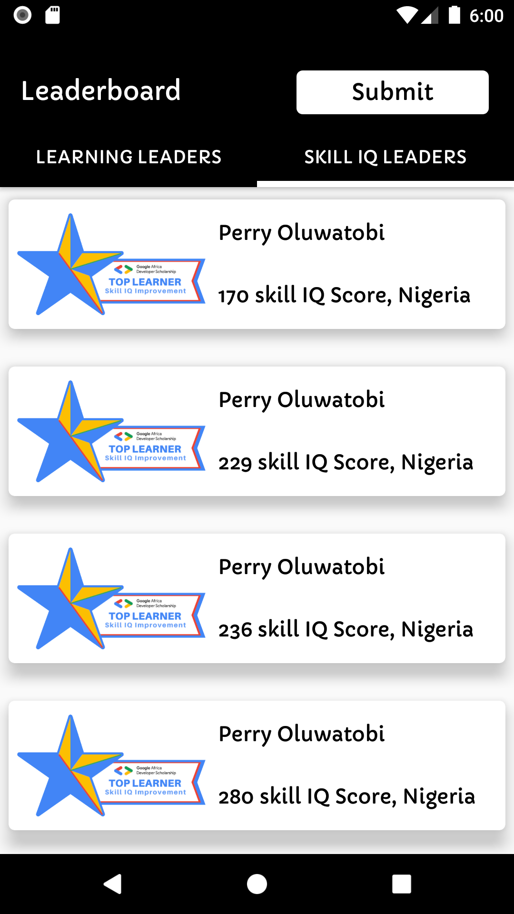
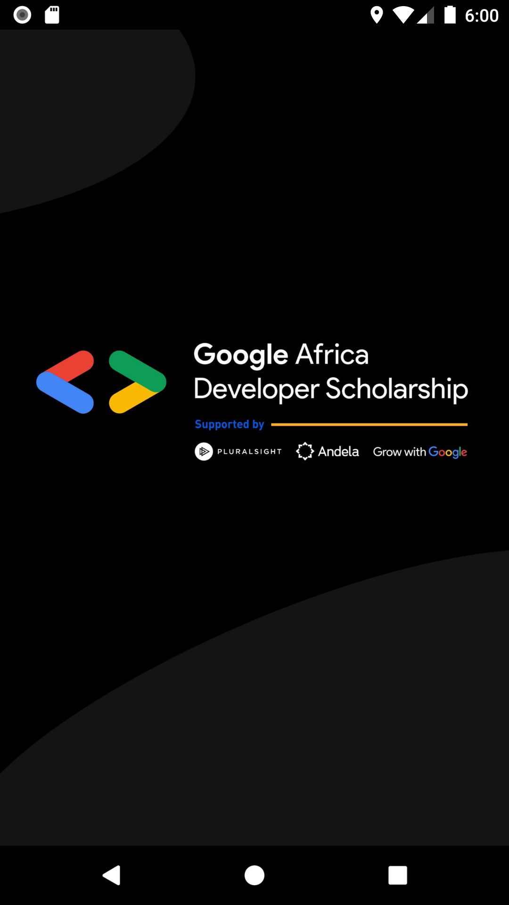
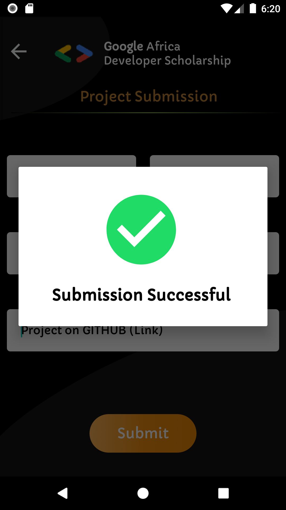
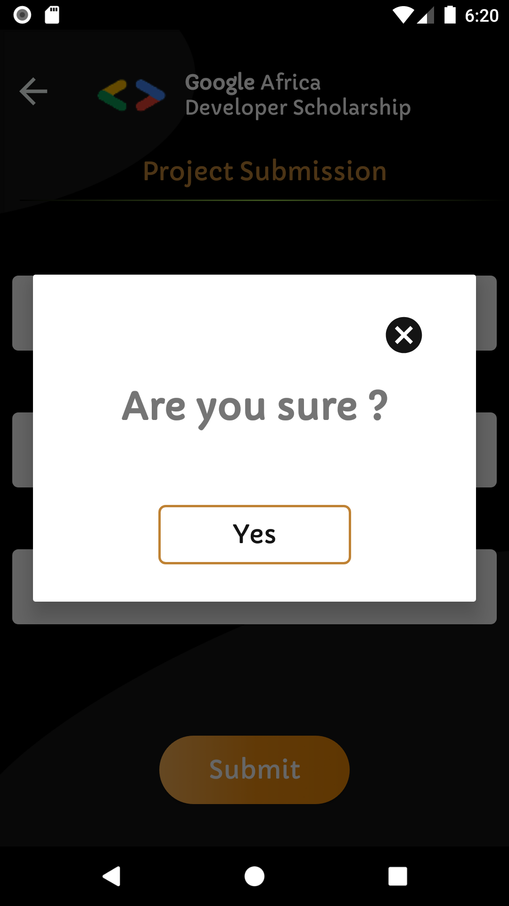
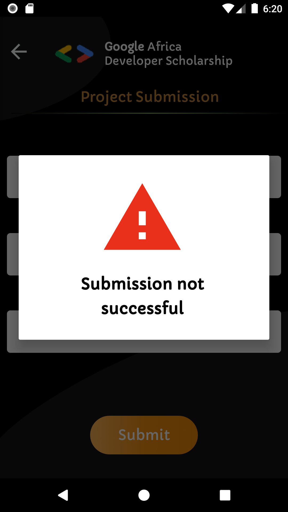

# GADS_Leaderboard
This project is a very simple Android Project aimed at implementing some simple concepts that are very important as far as Android Development is concerned.

# Project Preview

